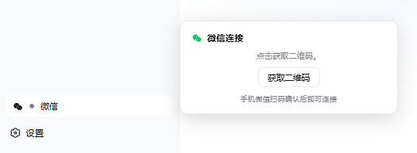

# dsh-wechat-gateway

[](https://github.com/Carl-5535/dsh-wechat-gateway/actions/workflows/ci.yml)
[](https://github.com/Carl-5535/dsh-wechat-gateway/blob/main/LICENSE)
[](https://nodejs.org/)

[DeepSeek Harness (DSH)](https://github.com/deepseek-ai/deepseek-harness) 的**进程内**微信插件：把你的个人微信变成 DSH Agent 的远程入口。

手机微信发消息 → 本机 `dsh web` 进程里的 Agent 干活 → 回复送回微信。不是外部 bridge：插件以 Cordis 插件形式直接运行在 DSH Host 进程内，每个微信聊天对应一个持久 DSH 会话，可在 Web UI 同时查看和接管。

<p align="center"></p>

## 特性

- **扫码即用**：DSH 侧边栏内直接扫码登录，二维码本地渲染、弹层内完成验证，全程不离开主页
- **持久会话**：每个聊天 ↔ 一个 DSH 会话，重启进程自动 resume；`/new` 随时重开
- **文件双向**：微信发来的图片/文件/视频落盘到工作区（图片同时喂给模型）；Agent 用 `[[send-file:路径]]` 回发工作区文件（realpath 防越界）
- **主动推送**：`wechat_notify` 工具让任何 DSH 会话（Web UI、微信、子 Agent）都能主动推送消息到你的微信
- **可靠投递**：回复经持久化发件箱分块发送（超长切分、失败重试、重启续发），消息去重
- **打字状态**、默认拒绝的安全模型（见下文）

## 快速开始

```shell
# 1. 安装 DSH（Node ≥ 20）与本插件
npm i -g @deepseek-ai/dsh
dsh plugin --profile web add "github:Carl-5535/dsh-wechat-gateway#main"

# 2. 启动
dsh web                          # 默认 http://127.0.0.1:3080

# 3. 扫码：侧边栏底部「微信」入口 → 点开 → 手机微信扫码
# 4. 用你自己的微信给机器人账号发条消息即可
```

> Windows 本地开发安装注意：用反斜杠绝对路径（`D:\path\to\dsh-wechat-gateway`），
> 不要写 `file:D:/...`——pnpm 在 Windows 上会拼错路径。macOS / Linux 用 `file:/绝对路径` 即可。

也支持不装全局 CLI：把上面的 `dsh` 换成 `npx @deepseek-ai/dsh`。

## 微信里的命令

| 命令 | 作用 |
| --- | --- |
| `/help` `/帮助` | 查看说明 |
| `/status` `/状态` | 查看会话状态 |
| `/stop` `/停止` | 中止当前任务 |
| `/new` `/新会话` | 丢弃上下文，开启全新会话 |
| `/model` `/模型` | 查看本地可用模型；`/model 序号`、`/model 模型id` 或 `/model provider/model` 切换（仅当前聊天生效，`/new` 后回到默认；Web UI 会话页同步显示） |

其余消息作为用户输入交给 DSH Agent 处理。凭据约 24 小时过期（腾讯策略），到期后侧边栏微信入口变灰，点开重新扫码即可。

## 主动推送（wechat_notify）

扫码登录后，插件向**所有** Agent 会话注册 `wechat_notify` 工具，推送目标为扫码登录的微信账号：

- 「编译/测试跑完后用 wechat_notify 通知我结果」
- 「每天早上 9 点把日报推到我微信」（配合 DSH 的定时/工作流能力）
- 长任务关键节点让 Agent 主动汇报

未登录时调用返回明确错误（Agent 会提示扫码）；消息超长自动分块、带重试、60 秒超时保护；微信会话内正常回复自动送达，无需调用此工具。

## 安全模型（务必阅读）

**任何能给登录账号发微信消息的人，都在向你的 DSH Agent 下达指令**——Agent 拥有工作区的文件读写与命令执行能力。因此本插件默认拒绝一切来源：

- 未配置白名单时，仅响应登录账号本人（扫码凭据自动进白名单）
- Agent 权限预设为 `workspace-write`（越界操作需审批）；出站文件经 realpath 校验锁定在工作区内
- 凭据与状态文件 600 权限落盘；登录相关路由仅限本机回环访问
- 微信通道条款禁止营销、客服、高频群发用途

## 配置（环境变量，均可选）

| 变量 | 默认值 | 说明 |
| --- | --- | --- |
| `WECHAT_BOT_TOKEN` | — | 直接注入 token（优先于凭据文件） |
| `WECHAT_CREDENTIAL_PATH` | `$DSH_HOME/wechat-gateway/account.json` | 凭据文件 |
| `WECHAT_STATE_PATH` | `$DSH_HOME/wechat-gateway/state.json` | 网关状态文件 |
| `WECHAT_WORKSPACE` | 用户主目录 | Agent 工作区（会话 cwd、文件收发边界） |
| `WECHAT_ALLOWED_USERS` | 登录账号本人 | 用户白名单，逗号分隔 |
| `WECHAT_MEDIA_DIR` | `$WORKSPACE/.wechat-gateway/inbox` | 入站媒体目录 |
| `WECHAT_BOT_API_BASE` | `https://ilinkai.weixin.qq.com` | iLink API 入口 |
| `WECHAT_CDN_BASE` | `https://novac2c.cdn.weixin.qq.com/c2c` | 媒体 CDN |
| `WECHAT_MAX_MESSAGE_CHARS` | `3500` | 单条回复最大字符数 |
| `WECHAT_MAX_MEDIA_BYTES` | `104857600` | 单个媒体大小上限 |

## 架构

```
手机微信 ⇄ 腾讯 iLink Bot API ⇄ ┌─ dsh web (Host 进程) ──────────────┐
                                 │  wechat-gateway 插件 (Cordis)       │
                                 │   ├─ ILinkClient  长轮询/发送/媒体   │
                                 │   ├─ WechatGateway 会话映射+投递队列  │
                                 │   ├─ wechat_notify 主动推送工具       │
                                 │   └─ 登录路由 + 侧边栏状态 UI         │
                                 │  agents.create/resume → DSH Agent   │
                                 └─────────────────────────────────────┘
```

- 入站：`getupdates` 长轮询 → 去重 → 白名单 → 命令或 `agent.followup()`
- 出站：`session/event` 的 `turn/end` → 提取助手文本 → 持久化 outbox → 分块/带文件投递
- 持久化：chatId→sessionId 映射、轮询游标、去重表、发件箱断点，全部落盘可续跑

## 开发

```shell
npm install
npm run typecheck   # 对官方 rc 类型的类型检查
npm test            # 46 个单元测试（协议层走 mock 传输）
npm run build       # 产出 lib/（含 web 客户端 bundle）
```

测试覆盖：文本切分与 send-file 指令提取、AES-128-ECB 媒体加解密往返、白名单默认拒绝、状态文件读写与损坏拒绝、iLink 长轮询/发送/打字/媒体上传全流程（mock fetch）、扫码登录状态机（含区域重定向与验证码）、`/model` 命令匹配逻辑（序号/id/provider-model 多形态）。

## 已知限制

- iLink 凭据有效期由腾讯控制（社区实测约 24 小时），到期需重新扫码
- 腾讯可能随时调整协议端点；微信条款禁止营销、客服、高频群发用途
- 每个聊天内消息串行处理（同一会话一次跑一个任务），多聊天之间并行

## 致谢与许可

[MIT License](https://github.com/Carl-5535/dsh-wechat-gateway/blob/main/LICENSE) 开源。

本插件独立实现，部分设计衍生自社区 MIT 实现并致谢：iLink 协议层与投递队列参考
[dsh-weixin](https://github.com/xiaoshihou514/dsh-weixin)（客户端打包脚本经改编使用），协议细节与
[dsh-wechat-bridge](https://github.com/gtaifu/dsh-wechat-bridge) 及官方开源 SDK 交叉验证。
完整第三方版权声明见 [LICENSE 第三方声明部分](https://github.com/Carl-5535/dsh-wechat-gateway/blob/main/LICENSE#third-party-notices)。
